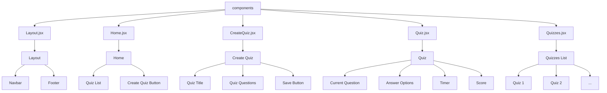

# Documentación de Arquitectura

Esta carpeta contiene los diagramas y documentación técnica de la arquitectura de la aplicación Kahoot Clone.

## Contenido

- `architecture.md`: Diagrama general de la arquitectura de la aplicación
- `frontend-components.md`: Diagrama detallado de los componentes del frontend
- `backend-structure.md`: Diagrama de la estructura del backend

## Diagramas

### Arquitectura General
```mermaid
graph TD
    A[Kahoot Clone App] --> B[Frontend (React)]
    A --> C[Backend (Node.js)]

    %% Frontend
    B --> D[src]
    D --> E[App.jsx]
    D --> F[components]
    D --> G[public]
    D --> H[index.css]
    D --> I[main.jsx]

    %% Backend
    C --> O[server]
    O --> P[server.js]
    O --> Q[Node Modules]
```

### Componentes del Frontend


### Estructura del Backend
```mermaid
graph TD
    C[Backend (Node.js)]
    C --> O[server]
    O --> P[server.js]
    O --> Q[Node Modules]

    %% Server
    P --> AN[API Routes]
    AN --> AO[GET /quizzes]
    AN --> AP[POST /quizzes]
    AN --> AQ[GET /quiz/:id]
    AN --> AR[POST /quiz/:id/answer]

    %% Dependencias
    C --> AV[Express]
    C --> AW[Socket.IO]
    C --> AX[MongoDB]
```
